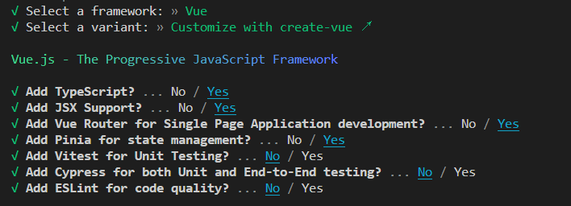
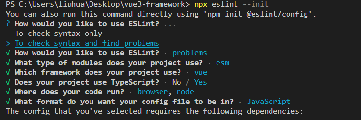
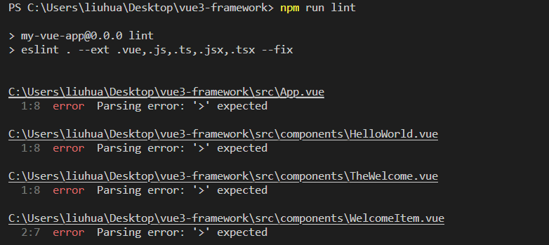
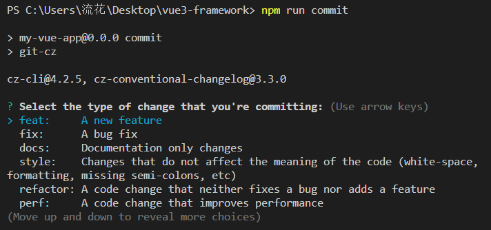
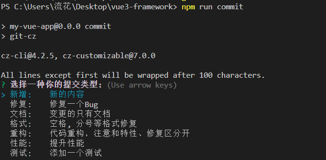

# vue3-framework 企业级项目搭建

## 一、项目初始化

我们采用 vite + vue3 + ts 来作为模板

```js
npm init vite@latest my-vue-app -- --template vue-ts
```



---

## 二、Eslint + Prettier 规范你的代码

#### 1、安装 eslint 并初始化

```js
npm i eslint -D
npx eslint --init
```



依赖安装完成后，会生成.eslintrc.js 配置文件

rules 规则可自行配置，此处配置开发常用的一些规则，至于这些规则的出处，可以去源码中查看或者去官网查看（node_modules 中.md 文件啥都有）

- [eslint 规则](https://www.runoob.com)
- [@typescript-eslint/recommended 规则](https://typescript-eslint.io/rules/)
- [vue/vue3-essential 规则](https://eslint.vuejs.org/rules/)

```js
module.exports = {
  env: {
    browser: true,
    es2021: true
  },
  extends: [
    'eslint:recommended',
    'plugin:vue/vue3-essential',
    'plugin:@typescript-eslint/recommended'
  ],
  parserOptions: {
    ecmaVersion: 'latest',
    parser: '@typescript-eslint/parser',
    sourceType: 'module'
  },
  plugins: ['vue', '@typescript-eslint'],
  rules: {
    eqeqeq: 'warn', // 全等
    'no-unused-vars': 'off', // 禁止出现未使用过的变量
    '@typescript-eslint/no-unused-vars': 'off', // 禁止未使用的变量
    'space-before-function-paren': 'off', // 强制在 function的左括号之前使用一致的空格
    'no-empty-function': 'off', // 禁止出现空函数
    '@typescript-eslint/no-empty-function': 'off', // 禁止空函数
    'no-undef': 'off', // 禁用未声明的变量，除非它们在 /*global */ 注释中被提到
    '@typescript-eslint/no-explicit-any': 'off', // 禁止any类型
    indent: 'off', // 强制使用一致的缩进
    '@typescript-eslint/no-var-requires': 'off', // 禁止require除导入语句外的语句
    '@typescript-eslint/ban-ts-comment': 'off', // 禁止@ts-<directive>评论或要求指令后的描述
    camelcase: 'off', // 强制使用骆驼拼写法命名约定
    'no-empty': 'off', // 禁止出现空语句块
    'no-new': 'off', // 禁止使用 new 以避免产生副作用
    '@typescript-eslint/no-non-null-assertion': 'off', // !使用后缀运算符禁止非空断言
    '@typescript-eslint/no-empty-interface': 'off', // 禁止声明空接口
    '@typescript-eslint/no-this-alias': 'off', // 禁止混叠this
    '@typescript-eslint/no-non-null-asserted-optional-chain': 'off', // 在可选链表达式之后禁止非空断言
    'no-useless-constructor': 'off', // 用不必要的构造函数
    'no-extra-semi': 'off', // 禁止不必要的分号
    '@typescript-eslint/no-extra-semi': 'off', // 禁止不必要的分号
    'vue/multi-word-component-names': 'off', // vue组件命名
    'no-debugger': 'off' // 禁用 debugger
  }
};
```

在 package.json 文件中的 script 中添加 lint 命令

```js
{
  "scripts": {
    // eslint . 为指定lint当前项目中的文件
    // --ext 为指定lint哪些后缀的文件
    // --fix 开启自动修复
    "lint": "eslint . --ext .vue,.js,.ts,.jsx,.tsx --fix"
  }
}
```

执行 lint 命令

```js
npm lint
```



.vue 后缀的文件时候出现解析错误 parsing error；eslint 默认是不会解析.vue 后缀文件的，需要一个额外的解析器来解析.vue 后缀文件。<br>

**_原因：_**<br>

在.eslintrc.js 文件中的 extends 会发现已经有继承"plugin:vue/vue3-essential"的配置。然后在 node_modules 中可以找到 eslint-plugin-vue/lib/cinfigs/essential，里面配置了 extends 是继承于同级目录下的 base.js，在里面会发现 parser: require.resolve('vue-eslint-parser')这个配置，按道理来说应该是会解析.vue 后缀文件的。<br>

然后.eslintrc.js 文件中的 extends 会发现，extends 中还有一个"plugin:@typescript-eslint/recommended"，它是来自于/node_modules/@typescript-eslint/eslint-plugin/dist/configs/recommended.js，查看该文件会发现最终继承于同级目录下的 base.js 文件。从该文件中可以发现 parser: '@typescript-eslint/parser',配置。<br>

最终导致报错的原因就是@typescript-eslint/parser 把 vue-eslint-parser 覆盖了。
查看 eslint-plugin-vue 官方文档可知。如果已经使用了另外的解析器（例如"parser": "@typescript-eslint/parser"），则需要将其移至 parseOptions，这样才不会与 vue-eslint-parser 冲突。<br>

修改.eslintrc.js 文件

```js
module.exports = {
  env: {
    browser: true,
    es2021: true,
    node: true
  },
  extends: [
    'eslint:recommended',
    'plugin:vue/vue3-essential',
    'plugin:@typescript-eslint/recommended'
  ],
  parser: 'vue-eslint-parser',
  parserOptions: {
    ecmaVersion: 'latest',
    parser: '@typescript-eslint/parser',
    sourceType: 'module'
  },
  plugins: ['vue', '@typescript-eslint'],
  rules: {
    ...
  }
};
```

外面的 parser 用来解析.vue 后缀文件，使得 eslint 能解析 template 标签中的内容，而 parserOptions 中的 parser，即@typescript-eslint/parser 用来解析 vue 文件中 script>
标签中的代码。

此时，再执行 npm lint，就会发现校验通过了。

#### 2、配置 prettier

```js
npm i prettier -D
```

- [prettier 规则选项](https://www.prettier.cn/docs/options.html)

在根目录下新建.prettierrc.js，并配置一些规则

```js
module.exports = {
  tabWidth: 2, // 一个tab代表几个空格数
  semi: true, // 行位是否使用分号，默认为true
  singleQuote: true, // 字符串是否使用单引号，默认为false，使用双引号
  printWidth: 80, // 一行的字符数，如果超过会进行换行，默认为80
  trailingComma: 'none', // 是否使用尾逗号，有三个可选值"<none|es5|all>"
  arrowParens: 'avoid', // 箭头函数单个参数的情况是否省略括号
  htmlWhitespaceSensitivity: 'ignore' // html中的空格敏感性
};
```

在 package.json 中的 script 中添加以下命令

```js
{
    "scripts": {
        "format": "prettier --write \"./**/*.{html,vue,ts,js,json,md}\"",
    }
}
```

#### 3、解决 eslint 与 prettier 的冲突

社区已经为我们提供了一个非常成熟的方案，即 eslint-config-prettier + eslint-plugin-prettier。

- eslint-plugin-prettier： 基于 prettier 代码风格的 eslint 规则，即 eslint 使用 pretter 规则来格式化代码。
- eslint-config-prettier： 禁用所有与格式相关的 eslint 规则，解决 prettier 与 eslint 规则冲突，确保将其放在 extends 队列最后，这样它将覆盖其他配置

```js
npm i eslint-config-prettier eslint-plugin-prettier -D
```

在 .eslintrc.json 中 extends 的最后添加一个配置

```js
{
    extends: [
    'eslint:recommended',
    'plugin:vue/vue3-essential',
    'plugin:@typescript-eslint/recommended',
    // 新增，必须放在最后面
    'plugin:prettier/recommended'
  ],
}
```

最后重启 vscode，你会发现冲突消失了，eslint 与 prettier 也按照我们预想的各司其职了，在运行时也能看到 ❌ 了。

---

## 三、husky + lint-staged + commitlint 规范提交

### 1、pre-commit 钩子

对于一些不使用 vscode 编辑器，或者没有安装 prettier 和 eslint 插件的用户而言，他们不能享受到插件带来的协助，而他们的代码自然大概率是不符合规范的，不该被提交到代码库。

社区提供了 husky(添加 git hook) + lint-staged(检查暂存区)的渐进式方案。

```js
npm i husky lint-staged -D
```

在 package.json 中添加脚本

```js
{
    "script":{
        "prepare": "husky install"
    }
}
```

运行 npm run prepare；会为我们添加一个.husky 的目录，用于存放 git hook

接下来我们为我们 git 仓库添加一个 pre-commit 钩子

```js
npx husky add .husky/pre-commit "npx --no-install lint-staged"
```

接下来我们配置 lint-staged,在 package.json 中添加下面的配置信息

```js
{
  "lint-staged": {
    "*.{js,vue,ts,jsx,tsx}": [
      "prettier --write",
      "eslint --fix"
    ],
    "*.{html,css,less,scss,md}": [
      "prettier --write"
    ]
  }
}
```

这样之后，我们后续提交到暂存区的代码也就会被 eslint+prettier 格式化和检查，进一步保证我们的代码规范。

### 2、commit-msg 钩子

安装必要包

```js
npm i commitlint @commitlint/config-conventional -D
// 创建出来的commitlint.config 需要另存为utf-8的格式
echo "module.exports = {extends: ['@commitlint/config-conventional']}" > commitlint.config.js
npx husky add .husky/commit-msg 'npx --no-install commitlint --edit "$1"'
```

- [commitlint 官网](https://commitlint.js.org/#/?id=getting-started)
- @commitlint/config-conventional 规范配置（默认是 Angular 的提交规范）

这个时候 commit msg 就需要符合 Angular 的提交规范才能通过钩子了，如`<type>(<scope>): <subject>`

安装辅助提交依赖

```js
npm i commitizen cz-conventional-changelog -D
npm set-script commit "git-cz"
npx commitizen init cz-conventional-changelog --save-dev --save-exact
```

这个时候，我们就可以通过 npm run commit | yarn commit 来提交代码了，你就会看到下面这种交互界面

## 

---

自定义提交规范（扩充内容，非必要）

```js
npm i -D commitlint-config-cz  cz-customizable
```

修改 commitlint.config 中的配置

```js
module.exports = { extends: ['cz'] };
```

既然使用了自定义的规范，cz-conventional-changelog 这个包就可以删掉了

增加 .cz-config.js

```js
'use strict';
module.exports = {
  types: [
    { value: '✨新增', name: '新增:    新的内容' },
    { value: '🐛修复', name: '修复:    修复一个Bug' },
    { value: '📝文档', name: '文档:    变更的只有文档' },
    { value: '💄格式', name: '格式:    空格, 分号等格式修复' },
    { value: '♻️重构', name: '重构:    代码重构，注意和特性、修复区分开' },
    { value: '⚡️性能', name: '性能:    提升性能' },
    { value: '✅测试', name: '测试:    添加一个测试' },
    { value: '🔧工具', name: '工具:    开发工具变动(构建、脚手架工具等)' },
    { value: '⏪回滚', name: '回滚:    代码回退' }
  ],
  scopes: [
    { name: 'leetcode' },
    { name: 'javascript' },
    { name: 'typescript' },
    { name: 'Vue' },
    { name: 'node' }
  ],
  // it needs to match the value for field type. Eg.: 'fix'
  /*  scopeOverrides: {
      fix: [
        {name: 'merge'},
        {name: 'style'},
        {name: 'e2eTest'},
        {name: 'unitTest'}
      ]
    },  */
  // override the messages, defaults are as follows
  messages: {
    type: '选择一种你的提交类型:',
    scope: '选择一个scope (可选):',
    // used if allowCustomScopes is true
    customScope: 'Denote the SCOPE of this change:',
    subject: '短说明:\n',
    body: '长说明，使用"|"换行(可选)：\n',
    breaking: '非兼容性说明 (可选):\n',
    footer: '关联关闭的issue，例如：#31, #34(可选):\n',
    confirmCommit: '确定提交说明?(yes/no)'
  },
  allowCustomScopes: true,
  allowBreakingChanges: ['特性', '修复'],
  // limit subject length
  subjectLimit: 100
};
```

package.json 中,将原来 commit 配置,变更为自定义配置

```js
"config": {
    "commitizen": {
      "path": "node_modules/cz-customizable"
    }
  }
```

然后提交会变成这样



> 费了九牛二虎之力才配置完成，有没有简单的方法呢？
> 答案自然是有的 [web-norm 一键生成配置](https://github.com/lyh0371/web-norm)
